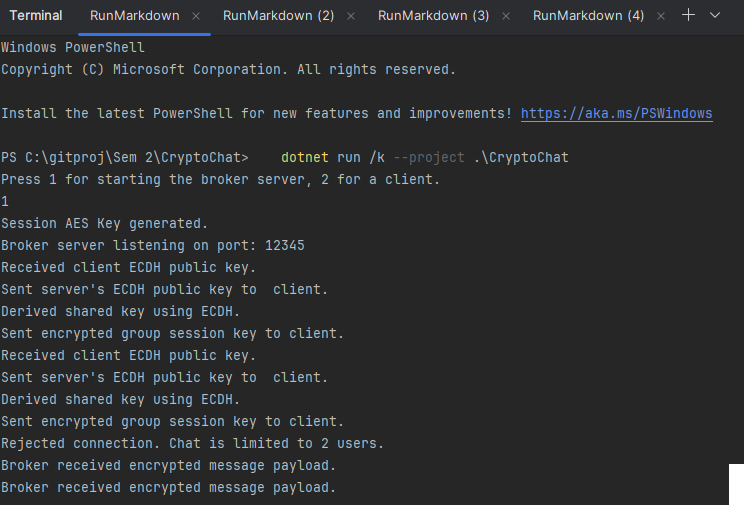
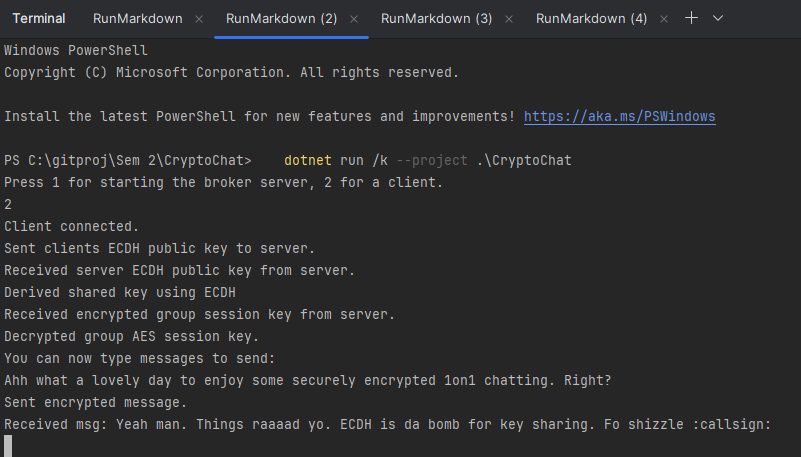
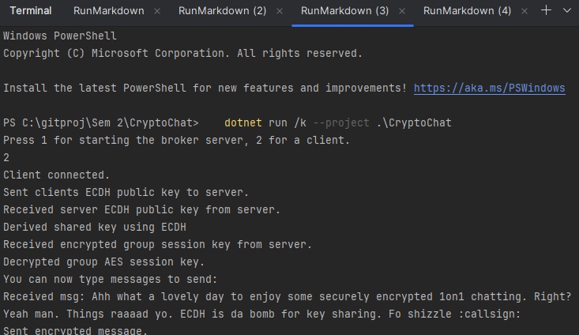
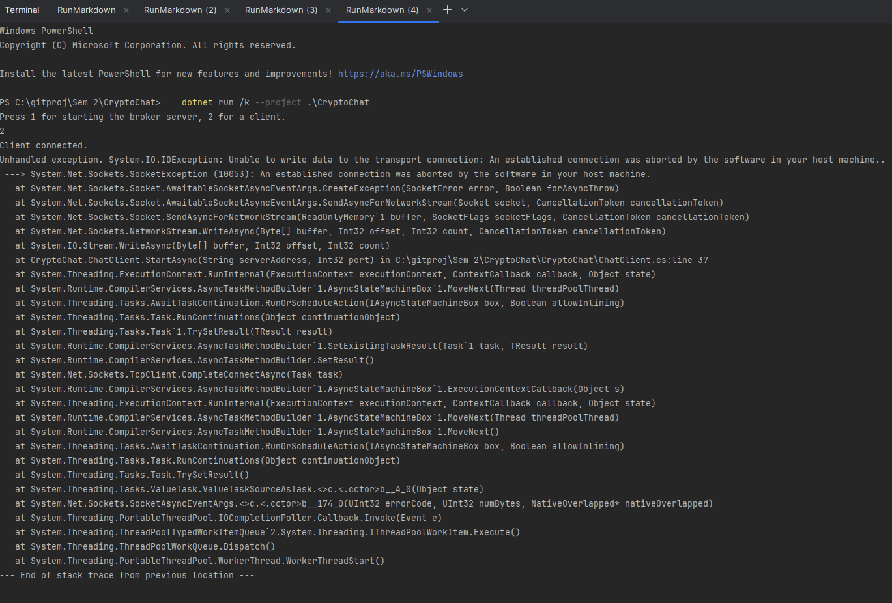

# CryptoChat - Secure Messaging Application

# Easy Setup:
Run the following command 3 times:
```bash
   dotnet run /k --project .\CryptoChat
   ```
**This should open 3 terminals. If not, follow "How To Run" step.**   

Input "1" and press enter in one terminal - this starts the BrokerServer.   
Input "2" and press enter into the two other terminals - this will start 2x Clients / Chatters. 


## Overview

CryptoChat is a secure chat application built in C# using TCP sockets. It demonstrates how to achieve confidentiality and integrity through modern cryptographic techniques. This proof-of-concept enables two users to chat securely without the risk of eavesdropping.


## Features

- **Secure Key Exchange:** Uses Elliptic Curve Diffie-Hellman (ECDH) to derive a shared secret between the client and the broker server.
- **Message Encryption & Integrity:** Implements AES-GCM for authenticated encryption, ensuring both confidentiality and integrity of messages.
- **Asynchronous Communication:** Uses asynchronous TCP sockets for near real-time communication.
- **Simple CLI Interface:** A minimalistic user interface for quick testing and demonstration.

## Architecture

The system consists of two main components:

- **BrokerServer:**  
  Acts as a message broker. It accepts connections from clients, performs the ECDH key exchange, encrypts the group AES session key with the shared secret, and relays encrypted messages to connected clients.

- **ChatClient:**  
  Connects to the BrokerServer, sends its ECDH public key, derives the shared secret using the server's public key, decrypts the group AES session key, and then uses that key to encrypt/decrypt chat messages.

## Cryptographic Techniques

- **ECDH (Elliptic Curve Diffie-Hellman):**  
  Both the server and client generate ephemeral ECDH key pairs, exchange public keys, and derive a shared secret used to secure the session key. This provides forward secrecy and ensures each session is uniquely secured.

- **AES-GCM (Galois/Counter Mode):**  
  AES-GCM is used to encrypt messages, providing both confidentiality and integrity through its authentication tag.

## Why This Approach to Cryptography

This project uses cryptography to meet two main goals: confidentiality and integrity.

- **ECDH** is used for key exchange between each client and the server. This allows both parties to agree on a shared secret without sending it directly. That secret is then used to deliver a symmetric AES key. ECDH was chosen because it provides forward secrecy and is supported in .NET.

- **AES-GCM** is used to encrypt all chat messages. GCM provides both encryption and message authentication in one step. This ensures no one can read or modify messages without being detected.

This combination of ECDH and AES-GCM makes it possible for two users to communicate securely, even over an insecure network.


## How to Run

### Prerequisites

- [.NET 6 SDK](https://dotnet.microsoft.com/download/dotnet/6.0) or later


### Running the Broker Server

1. Open a terminal and navigate to the project directory ("\CryptoChat").
2. Run the following command:

   ```bash
   dotnet run
   ```

3. When prompted, press **1** to start the Broker Server. This will launch the server, which:
    - Generates the AES session key.
    - Listens for incoming client connections.
    - Performs the ECDH key exchange with each connecting client.
    - Encrypts the group AES session key using the derived shared secret.
    - Relays encrypted messages to all connected clients.

### Running the Chat Client

1. Open two additional terminals and navigate to the project directory(\CryptoChat) in both of them.
2. Run the following command:

   ```bash
   dotnet run
   ```

3. When prompted, press **2** to start a Chat Client. The client will then:
    - Connect to the Broker Server.
    - Generate its ECDH key pair and send its public key.
    - Receive the server's ECDH public key.
    - Derive a shared secret using ECDH.
    - Decrypt the encrypted AES session key using the shared secret.
    - Allow you to type messages that are encrypted with AES-GCM and sent to the Broker Server.

You can now type messages in the Chat Client terminal, and they will be securely exchanged between all running clients through the Broker Server.

## Screenshots

### BrokerServer    
    
### Client 1

### Client 2

### Client 3 - Rejected


## Future Improvements

- Improve error handling and disconnection management.
- Add support for private messaging.
- Implement additional integrity checks (e.g., message authentication codes).
- Optionally, build a graphical user interface (GUI) for enhanced usability.

## License

This project is licensed under the MIT License.

